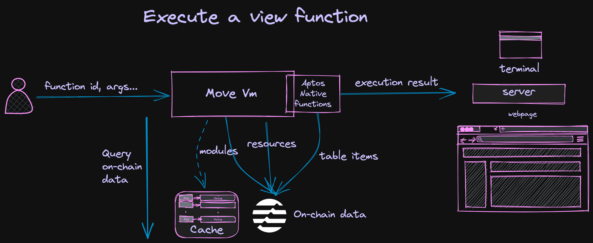

#  Sentio Composer - Execute View Functions on Aptos Blockchain
This project can be used to call view functions on the aptos blockchain. Given the input of the function and the corresponding ledger version, tool can execute that function and return the corresponding result.

It doesn't require the view functions as entry functions, and now supports the networks including mainnet, testnet and devnet.

This project includes a CLI tool and we've also built a demo web app on top of it.
You can choose to use the CLI tool or directly start the web application locally via docker.

## View live demo at http://composer.sentio.xyz :sparkles:

## How it works


## Start the Web Application with Docker
```shell
sudo docker run --env BIN_PATH="/app/view-function" -d -p 8080:4000 poytr1/sentio-composer-app:latest
```
Then open `http://localhost:8080/` to use it:


## Install the CLI tool
You can choose to build the CLI tool on your own or download the binary directly from [release](https://github.com/sentioxyz/sentio-composer/releases) page.
### To build it on your own:
#### Install the Rust and Cargo
`curl https://sh.rustup.rs -sSf | sh`
#### To install the CLI tool globally
`cargo install --git https://github.com/sentioxyz/sentio-composer`
### To build debug or release binary locally
1. Clone the project, and run `cargo build` in the root of the project.
2. Release build, run `cargo build --release`.
3. Check the target folder, you should find the binary **target/debug/view-function** or **target/release/view-function**.

## CLI Usage
### Run the CLI
`view-function -h`
``` 
Call the view function on Aptos blockchain

Usage: view-function [OPTIONS] --function-id <FUNCTION_ID>

Options:
  -f, --function-id <FUNCTION_ID>
          Function name as `<ADDRESS>::<MODULE_ID>::<FUNCTION_NAME>`
  -a, --args [<ARGS>...]
          Arguments separated by spaces
  -t, --type-args [<TYPE_ARGS>...]
          TypeTag arguments separated by spaces
  -l, --ledger-version <LEDGER_VERSION>
          Ledger version, if not apply or 0, use the latest ledger version [default: 0]
  -n, --network <NETWORK>
          Network to use [default: mainnet] [possible values: mainnet, testnet, devnet]
  -c, --config <CONFIG>
          Config file to use
      --log-level <LOG_LEVEL>
          Log level [default: off] [possible values: off, error, warn, info, debug, trace]
  -h, --help
          Print help information (use `--help` for more detail)
  -V, --version
          Print version information
```
### Example
```shell
# command
view-function \
--function-id 0x1::coin::balance \
--type-args 0x1::aptos_coin::AptosCoin \
--args 0x21ddba785f3ae9c6f03664ab07e9ad83595a0fa5ca556cec2b9d9e7100db0f07 \
--ledger-version 35842267 \
--network mainnet
# output
{
  "log_path": "",
  "return_values": [
    3120544100
  ]
}
```
### Config file
You can also write some static configurations like log folder and network url settings to a local configuration file, the default file is `config.toml` in the tool running directory.
Here is an example:
```toml
[config]
log_folder = ".log"
cache_folder = "."
network_configs = { testnet = "https://fullnode.mainnet.aptoslabs.com/v1" }
```
### Logs
The default log folder is `.log` in the tool running directory.

## Web App
We also build a web app on top of the CLI tool, but it's for demo purpose only.
### To start the web service:
```shell
cd app/server
npm install
npm run start
```
### To start the frontend in dev mode
```shell
cd app/client
npm install
npm run serve
```
Now open `http://localhost:8080/`, you should find the App is up.
