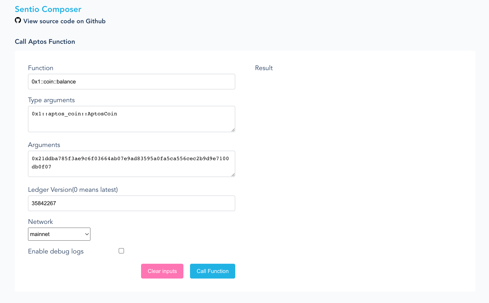

# Execute Any View Functions on Aptos Blockchain
This project can be used to call view functions on the aptos blockchain. Given the input of the function and the corresponding ledger version, tool can execute that function and return the corresponding result.

It doesn't require the view functions as entry functions, and now supports all the networks including mainnet, testnet and devnet.

This project includes a CLI tool, also we are building a web app on top of it.
## Install the CLI tool
You can choose to build the CLI tool on your own or download the binary directly from [release](https://github.com/sentioxyz/sentio-composer/releases) page.
### To build it on your own:
#### Install the Rust and Cargo
`curl https://sh.rustup.rs -sSf | sh`
#### To install the CLI tool globally
`cargo install --git https://github.com/sentioxyz/sentio-composer`
### To build debug or release binary locally
1. Clone the project, and run `cargo build` in the root of the project.
2. Release build, run `cargo build --release`.
3. Check the target folder, you should find the binary **target/debug/view-function** or **target/release/view-function**.

## CLI Usage
### Run the CLI
`view-function -h`
```shell
Usage: view-function [OPTIONS] --func <FUNCTION>

Options:
  -F, --func <FUNCTION>
          Function name to call, e.g. 0x1::foo::bar.
  -T, --type_args <TYPE_ARGS>
          Type parameters, seperated by ',' e.g. 0x1::aptos_coin::AptosCoin. [default: ]
  -A, --args <ARGS>
          Parameters, seperated by ',' e.g. foo, bar. [default: ]
  -L, --ledger_version <LEDGER_VERSION>
          Ledger version, if not apply or 0, use the latest ledger version. [default: 0]
  -N, --network <NETWORK>
          Network to use, e.g. mainnet. [default: mainnet]
  -C, --config <CONFIG_FILE>
          Config file to use. [default: config.toml]
  -h, --help
          Print help information
  -V, --version
          Print version information

```
### Example
```shell
# command
view-function \
--func 0xeaa6ac31312d55907f6c9d7a66432d92d4da3aeef7ceb4e6242a8414ac67fa82::vault::account_collateral_and_debt \
--type_args 0x1::aptos_coin::AptosCoin \
--args 0xf485fdf431d489c7bd0b83efa2413a6701fe4985d3e64a299a1a2e9fb46bcb82 \
--ledger_version 0 \
--network testnet
# output
{
  "log_path": ".log/aptos_tool_bin.log",
  "return_values": [
    "800000000u64",
    "1103000000u64"
  ]
}
```
### Config file
You can also write some static configuration like log folder and network url settings to a local configuration file, the default file is `config.toml` in the tool running directory.
Here is an example:
```toml
[config]
log_folder = ".log"
network_configs = { testnet = "https://aptos-testnet.nodereal.io/v1/1111111111111111/v1" }
```
### Logs
The default log folder is `.log/aptos_too_bin.log` in the tool running directory.

## Web App
We also build a web app on top of the CLI tool, but it's in an early stage. For now you can try it locally.
### To start the web service:
```shell
cd app
npm install
npm run start
```
### To start the frontend in dev mode
```shell
cd app/client
npm install
npm run serve
```
Now open `http://localhost:8080/`, you should find the page is up. 
### To start the web server with docker
```shell
sudo docker run --env BIN_PATH="/app/view-function" -d -p 4000:4000 poytr1/sentio-composer-server:latest
```
